# dwfinance

Reads DBS and POSB statement PDFs and sorts every transaction on your own computer.

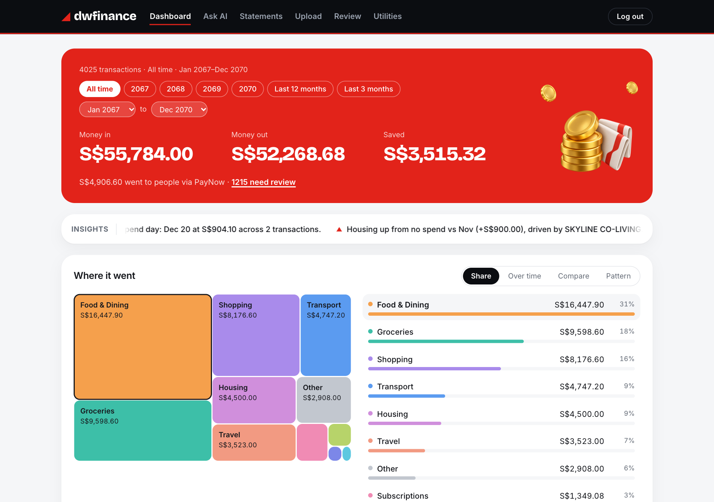

> **What this is.** A student project built for the DLW Datathon (finance track). It has been tested on
> DBS/POSB statements and on synthetic sample data only. It is not financial advice.
> **Not affiliated with DBS Bank Ltd.** Every name and number in the screenshots is made up.

## Contents

- [What it does](#what-it-does)
- [Start it](#start-it)
- [Turn on Ask AI](#turn-on-ask-ai)
- [Where your data goes](#where-your-data-goes)
- [Known limits](#known-limits)
- [More documentation](#more-documentation)
- [How this was built](#how-this-was-built)

## What it does

| Feature | What you get |
|---|---|
| Read a statement | Add a PDF. Every transaction is found, each amount is worked out from the statement's own running balance, and every line is checked. A statement that does not add up is saved with a "Needs checking" label saying exactly what is wrong. |
| Sort into categories | Known Singapore merchants are sorted into 15 categories (including Housing, Education and Travel) by rules. Unclear payees go to a Review list, one row per payee, instead of being guessed silently. |
| Teach it once | Tell it who a PayNow payee is. The answer is saved and applied to every past and future payment to that payee. |
| Dashboard | Money in, money out, saved; where it went (four views); monthly spend against your normal range; money flow; a calendar you can tap for each day's payments; subscriptions; alerts. |
| Statements | Search, filter, group and export every transaction. |
| Ask AI (optional) | Ask questions in plain English. A model on your own computer answers, and each answer links to the transactions behind it. |

### Dashboard

"Where it went" has four views of the same spending: share, over time, this period against the one
before, and a month-by-month pattern.

| Over time | Compare | Pattern |
|---|---|---|
| 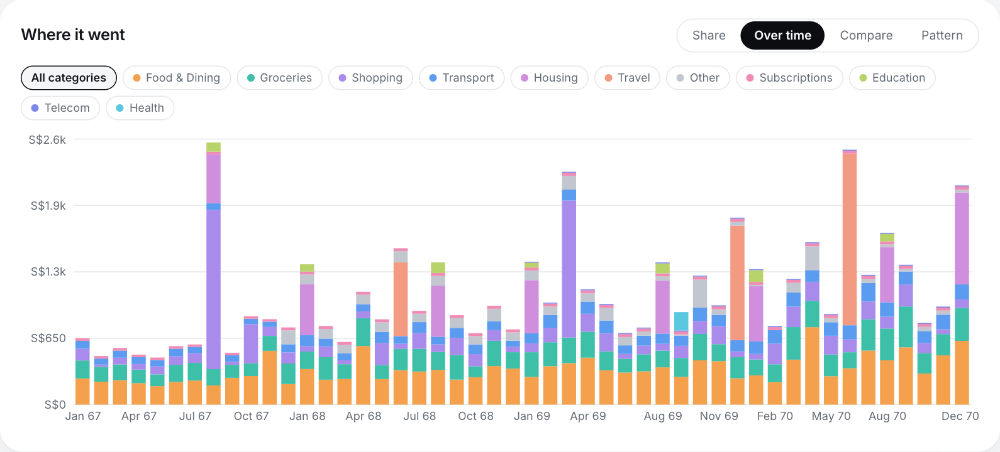 | 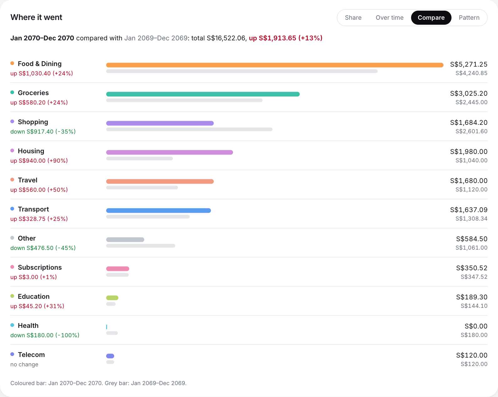 | 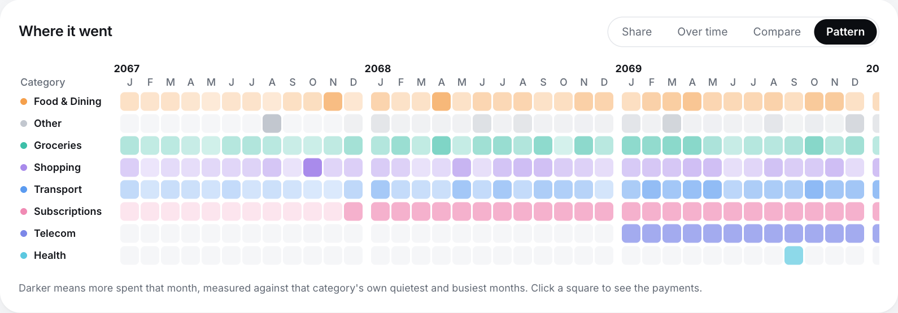 |

Monthly spend shows each month against your normal range (the middle half of the 12 months before it).
Large one-off purchases, such as a laptop or a flight, are shown separately and can be switched off, so a single
purchase does not look like a spending problem. A "By year" view lines the years up to show seasonal patterns.

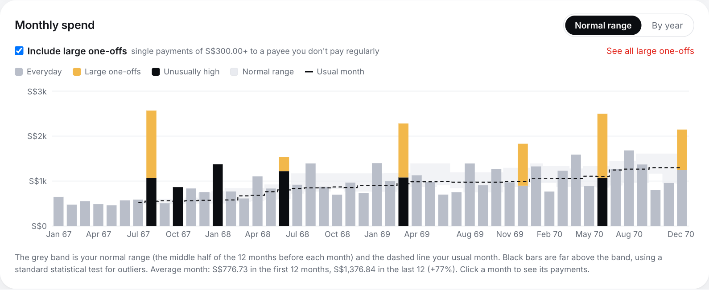

The money flow shows where money came from and where it went, including what was saved.

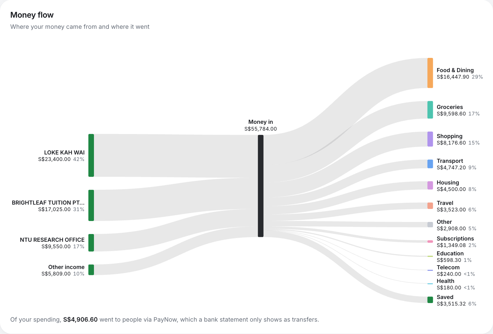

The calendar colours each day by how heavy the spending was compared with your own usual days. Tap a day to see
its payments.

| Calendar | One day's payments |
|---|---|
| 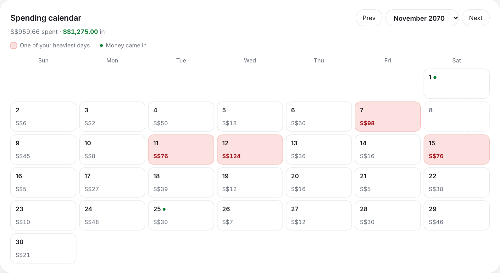 | 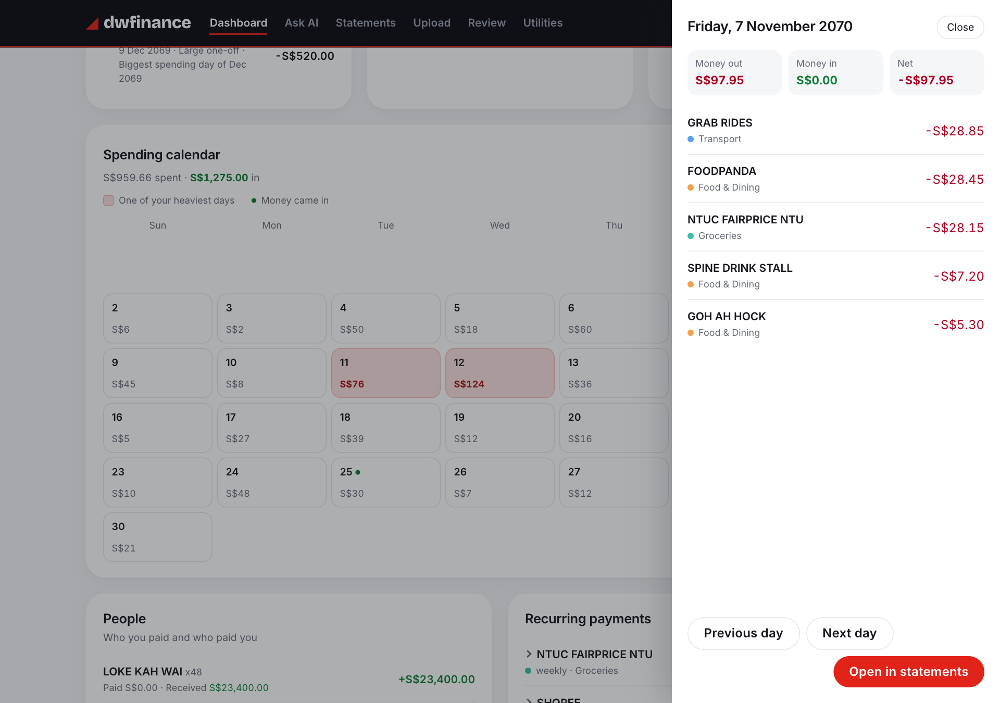 |

### Statements

Every transaction, with search that understands words, exact phrases, exclusions and amounts
(`grab >10`, `"ong bee lian"`, `-food`, `10..20`).

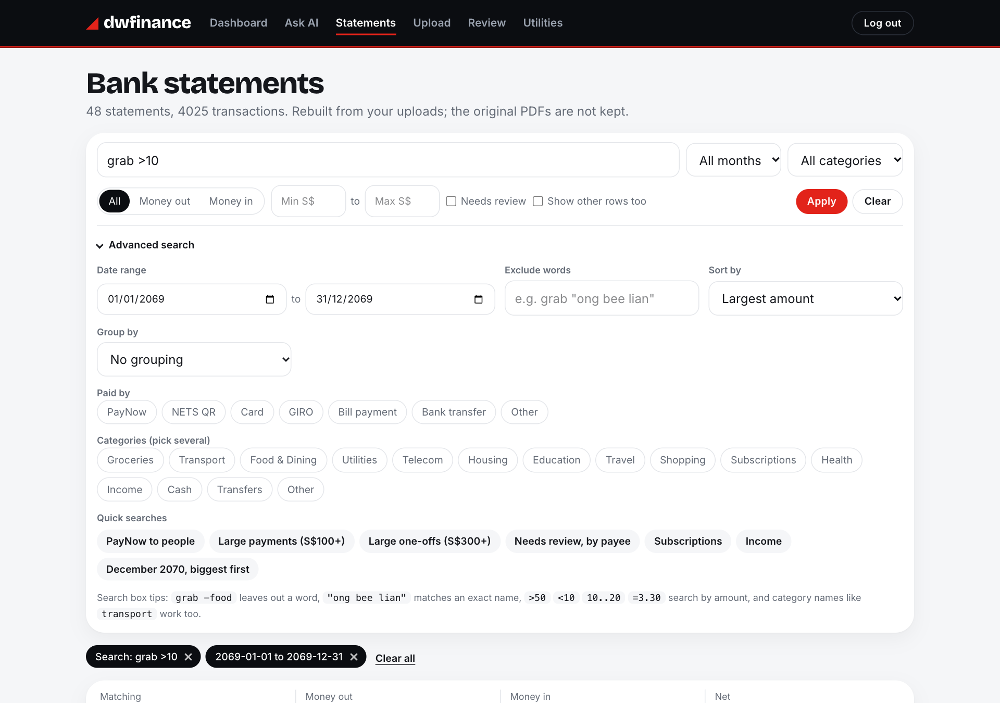

### Ask AI

Answers come from lookups against your own transactions, not from the model's memory. "See in bank
statement" opens the exact rows an answer was based on.

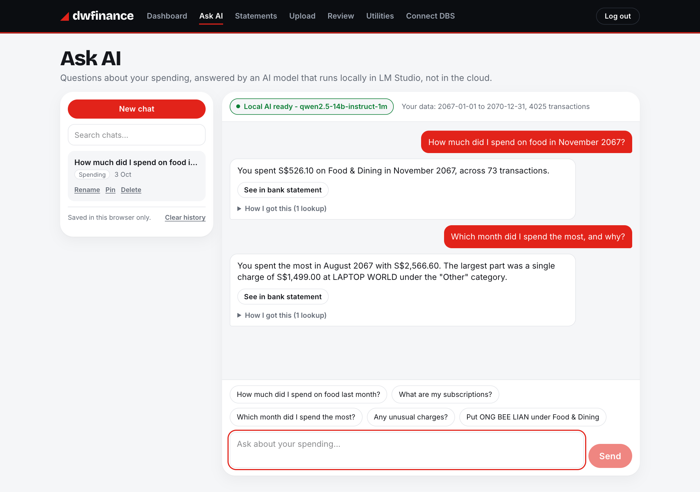

The model can never change your data by itself. It can only propose a change, which you confirm or cancel.

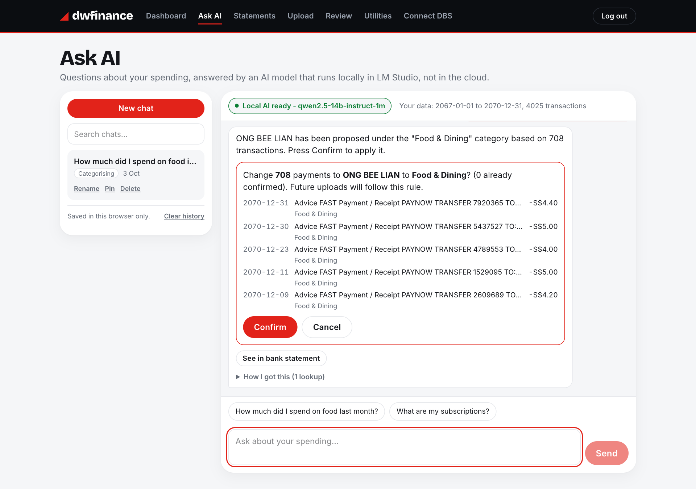

### Review and upload

| Review | Upload |
|---|---|
| 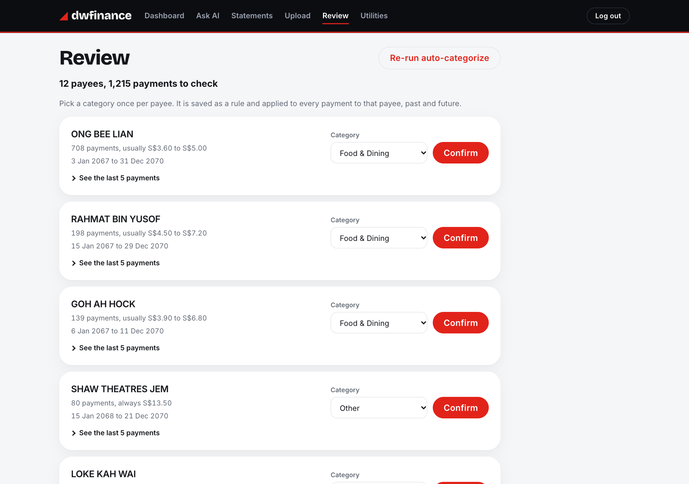 | 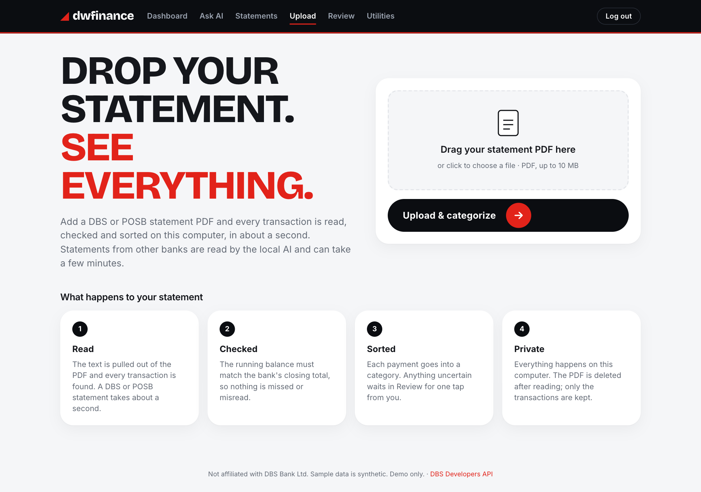 |

### On a phone

| Dashboard | Statements | Ask AI |
|---|---|---|
| 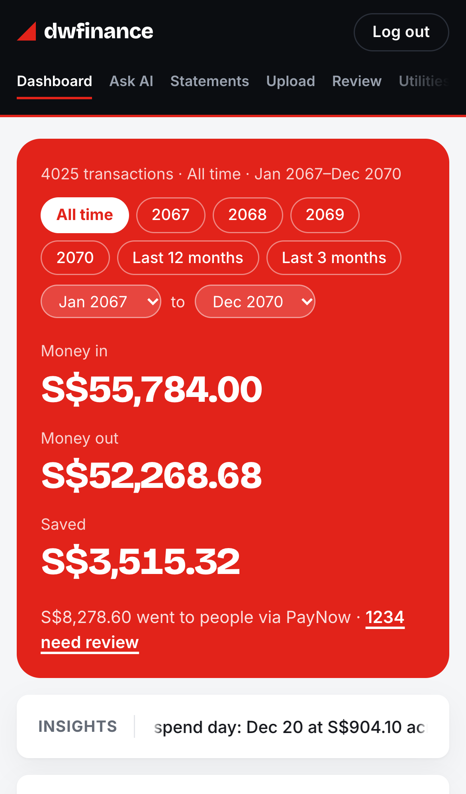 | 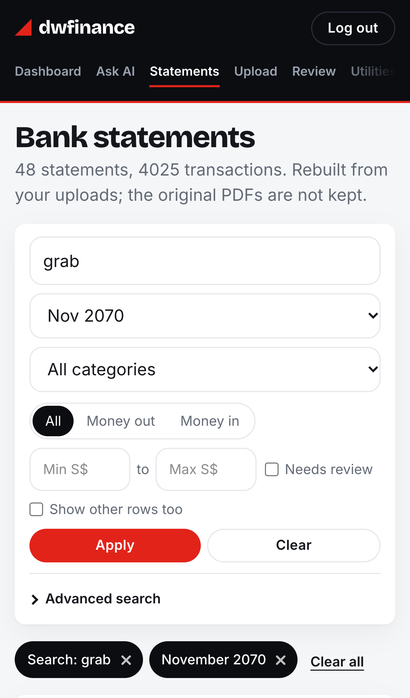 | 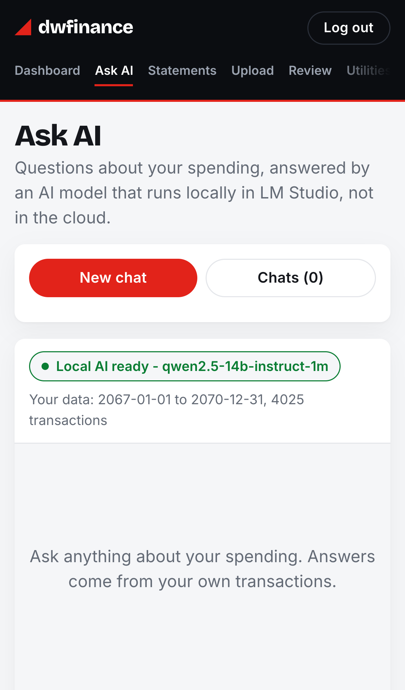 |

## Start it

You need [Node.js](https://nodejs.org) 20 or newer (free; pick the LTS download).

1. Download this repository (green **Code** button, then **Download ZIP**) and unzip it, or `git clone` it.
2. Double-click the start file for your computer:

   | Computer | File |
   |---|---|
   | Mac | `Start dwfinance (Mac).command` |
   | Windows | `Start dwfinance (Windows).bat` |

3. Wait for the browser to open, then press **Fast access**.

The first start takes a few minutes: it downloads what the app needs (about 1 GB), creates a local
database and loads 48 synthetic sample statements (a fictional student, 2067 to 2070). Later starts take
a few seconds. Keep the window that opens while you use the app; close it to stop.

Prefer a terminal, or on Linux? Run this in the folder. It does the same thing:

    npm run app

Demo account: `demo@dwfinance.local` / `Password123!`

To use your own data, create an account and upload a DBS or POSB statement PDF on the Upload page.

If something does not start, see [Troubleshooting](docs/TROUBLESHOOTING.md).

## Turn on Ask AI

Ask AI is optional. Everything else works without it. The model is not part of this download; you get
it once through [LM Studio](https://lmstudio.ai), which is free.

1. Install LM Studio and download one model:

   | Your laptop | Model to search for in LM Studio | Download size |
   |---|---|---|
   | 8 to 16 GB memory | `google/gemma-4-e4b` | about 6 GB |
   | 16 GB or more | `qwen2.5-14b-instruct` | about 9 GB |

2. Load the model with **context length 16384** (the default is too small for this app).
3. Start LM Studio's local server (Developer tab, port 1234).
4. Open Ask AI in the app. The badge at the top shows "Local AI ready" and the model name.

The app uses whichever model is loaded. Until one is running, the Ask AI page shows these same steps:

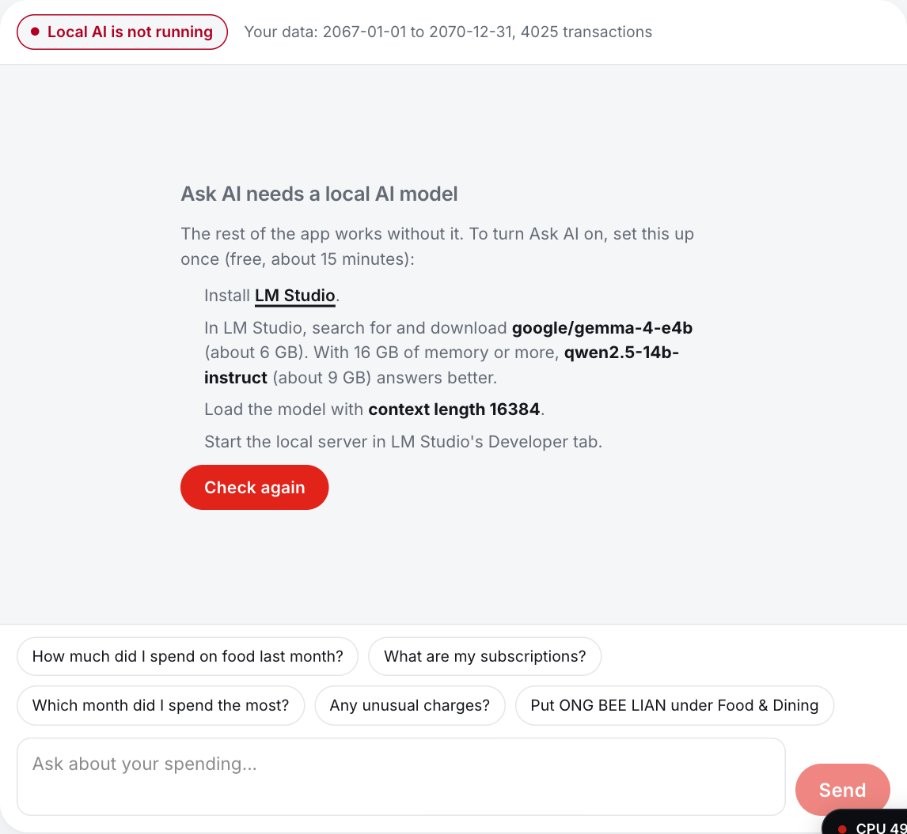

## Where your data goes

- Everything is stored in one file on your computer: `prisma/dev.db`.
- The uploaded PDF is read and then discarded. Only the transactions are kept.
- Ask AI talks to LM Studio on your own computer. No cloud AI service is used.
- Passwords are stored hashed (bcrypt). Chat history is kept in your browser only.
- The app only accepts connections from your own computer (`127.0.0.1`), never from other devices on your network.

## Known limits

- **Built and tested on macOS only.** The setup uses only Node.js, so it is expected to work on Windows
  and Linux, but neither has been tried yet, including the double-click Windows start file.
- **Only DBS and POSB statement PDFs are read by the built-in reader.** Other banks' statements are
  handed to the local AI model, which is slow and can make mistakes.
- **Ask AI was tested with the two models above**, on one Mac. Smaller models answer faster but pick the
  wrong lookup more often.
- **Nothing in this app connects to DBS or to any bank.** It only reads PDFs you add yourself.
- **The sample data is synthetic.** Any resemblance to real people or payments is coincidental.

## More documentation

| Page | What it covers |
|---|---|
| [How it works](docs/HOW_IT_WORKS.md) | From PDF to sorted transactions, step by step |
| [The AI chat and its guard rails](docs/AI_CHAT.md) | What the model can and cannot do, and how made-up numbers are prevented |
| [Code map](docs/CODE_MAP.md) | Where each part lives, and how to change common things |
| [Sample data](docs/SAMPLE_DATA.md) | How the synthetic statements are generated |
| [Design](docs/DESIGN.md) | Colours, fonts and layout rules |
| [Troubleshooting](docs/TROUBLESHOOTING.md) | Common start-up problems |
| [Roadmap](docs/ROADMAP.md) | What is planned and not built yet |

## How this was built

The product and design decisions were made by the author. The code was written with AI coding tools
(Anthropic's Claude and OpenAI's Codex) under the author's direction, and checked with automated tests
and real-browser checks. The coin artwork in the dashboard header was generated with an AI image model.

## Commands

| Command | What it does |
|---|---|
| `npm run app` | Set up if needed, start the app and open it in the browser |
| `npm run setup` | Reset the demo account's sample data |
| `npm run dev` | Start the app only, at http://localhost:3000 |
| `npm test` | Run the automated tests |
| `npm run build` then `npm start` | Production mode |

## Built with

Next.js, React, TypeScript, Prisma with SQLite, Recharts, unpdf, pdfkit, and LM Studio for the local model.

## Licence

[MIT](LICENSE). Not affiliated with DBS Bank Ltd.
