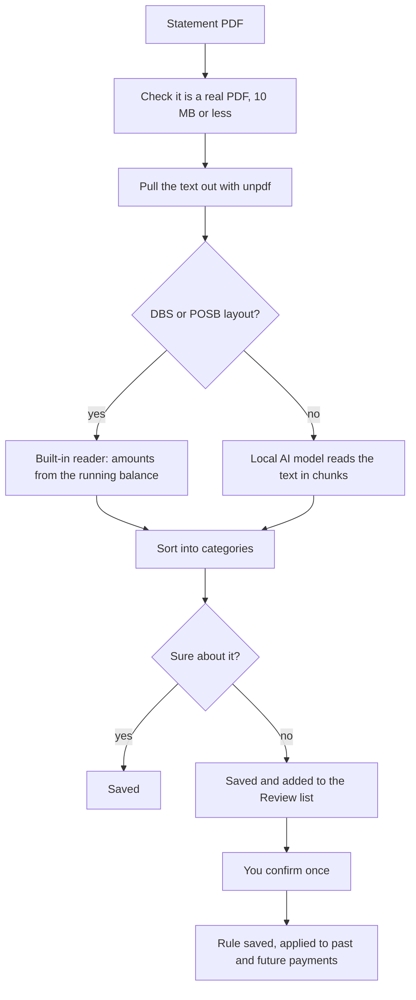

# How it works

This page follows one statement from PDF to dashboard. File names point at the code that does each step.

## 1. The file is checked

`src/server/parse-statement.ts`

- The file must start with the bytes `%PDF-`. The file type claimed by the browser is ignored.
- Anything over 10 MB is refused.
- A fingerprint (SHA-256) of the file is compared with earlier uploads, so the same statement is not added twice.

## 2. The text is pulled out

The [unpdf](https://github.com/unjs/unpdf) library extracts the text. If almost no text comes out, the
file is probably a scan or is password-protected, and the upload stops with a message saying so.

The PDF itself is not kept. Only the transactions found in it are stored.

## 3. Transactions are found

### DBS and POSB statements: the built-in reader

`src/server/parse-dbs.ts` (38 lines, no AI)

A DBS or POSB consolidated statement prints the running balance after every transaction. The reader uses
that instead of trusting the amount column:

    amount = balance after this line - balance before this line

This has two useful effects:

The sign is therefore always right: a payment makes the balance go down, a deposit makes it go up, and
there is no need to guess which column a number sat in.

### The checks

The reader then checks its own work. A statement that passes every check is saved quietly. One that fails
any check is still saved, but labelled **Needs checking** on the Statements page with each problem in plain
English, and its doubtful lines go to the Review list.

| Check | Catches |
|---|---|
| Each line's printed amount equals the change in balance | A mistyped number, two lines merged into one, a line missing from the text |
| Each page's opening balance continues the previous page's closing balance | A missing, repeated or out-of-order page |
| The last balance equals the statement's stated total | Anything else that went wrong in between |
| Every date is a real calendar date | 32/01 or 30/02, which would otherwise roll into the next month |
| Every date falls in the statement month (allowing 10 days of posting delay) | A line from the wrong year or month |
| The statement has an opening balance | Without one, the first line's direction (in or out) cannot be known |

The reader also handles two things that used to trip it up: an overdrawn (negative) balance, and an amount
printed with no space before the balance. The closing summary line, which starts with a date like a
transaction does, is recognised and not saved as a transaction.

These checks are covered by automated tests built from deliberately broken statements
(`tests/unit/statement-checks.test.ts`), and all 48 sample statements must pass every check.

### Other banks: the local AI model

`aiExtractStatement` in `src/server/categorize.ts`

If the built-in reader finds nothing, the text is cut into overlapping chunks and each chunk is given to
the local model with a strict output format. Duplicates from the overlaps are removed. This path is slow
(minutes, not seconds), needs LM Studio running, and can make mistakes. There is no running balance to
check against, so these statements are always labelled **Needs checking**. Lines with an impossible date
or amount are left out and listed.

## 4. Each transaction is sorted into a category

`src/server/categorize.ts`, `src/server/merchants.ts`

The categories are: Groceries, Transport, Food & Dining, Utilities, Telecom, Housing, Education, Travel,
Shopping, Subscriptions, Health, Income, Cash, Transfers, Other. Housing, Education and Travel only ever
apply to money going out, so a salary from a tuition centre stays Income.

For a DBS or POSB statement the steps are tried in this order, and the first one that answers wins:

| Step | What it does | Marked for review? |
|---|---|---|
| 1. Your saved rules | If you have confirmed this payee before, your answer is used | No |
| 2. Singapore merchant rules | A list of keywords: NTUC and Sheng Siong are Groceries, Grab and BUS/MRT are Transport, Netflix is Subscriptions, and so on | No |
| 3. Best guess | A PayNow or NETS QR payment to a named person or small stall of S$20 or less is guessed as Food & Dining, a larger one as Transfers. Money coming in is guessed as Income. Everything else is Other. | Yes |

No AI is used on this path, so a DBS or POSB statement is sorted the same way every time.

For statements read by the AI model, a fourth step sits between 2 and 3: the model is asked to categorise
only the rows the rules could not.

### Why payments to people are the hard part

A bank statement shows a PayNow payment as a transfer to a name. It cannot know that "ONG BEE LIAN" is
the drinks stall where you buy breakfast. Nothing in the statement can settle that, so the app does not
pretend to know: it makes a marked guess and asks you.

## 5. Teach it once

`src/server/rules.ts`

On the Review page (or through Ask AI) you confirm the category for a payee one time. The Review page shows
one row per payee with how many payments it covers and their usual amount, so a payee paid 700 times is one
decision. Confirming does two things:

1. Saves a rule for that payee.
2. Updates every existing transaction for that payee, and removes them from the Review list.

Every later upload checks saved rules first, so the same payee is never asked about again.

The payee is matched by a cleaned-up name: reference numbers, account numbers and bank boilerplate are
stripped out, so "PAYNOW TRANSFER 5992280 TO: ONG BEE LIAN" and "PAYNOW TRANSFER 2821666 TO: ONG BEE LIAN"
are recognised as the same payee.

## 6. The dashboard is worked out from the transactions

Nothing on the dashboard is stored separately. Each section is calculated from the transactions in the
period you picked:

| Section | Code |
|---|---|
| Where it went | `src/app/dashboard/page.tsx`, `src/components/dashboard-charts.tsx` |
| Monthly spend, normal range and large one-offs | `src/lib/spend-trend.ts`, `src/components/spend-trend.tsx` |
| Recurring payments | `src/lib/recurring.ts` |
| Money flow | `src/lib/cashflow.ts` |
| Subscriptions and price changes | `src/server/subscriptions.ts` |
| Alerts (large, duplicate, new merchant, spikes) | `src/server/alerts.ts` |
| Insights ticker | `src/server/insights.ts` |
| Financial health | `src/server/financial-health.ts` |
| People you pay and are paid by | `src/server/peer-analytics.ts` |

Money is stored as whole cents (integers), never as decimals, so totals do not drift.
